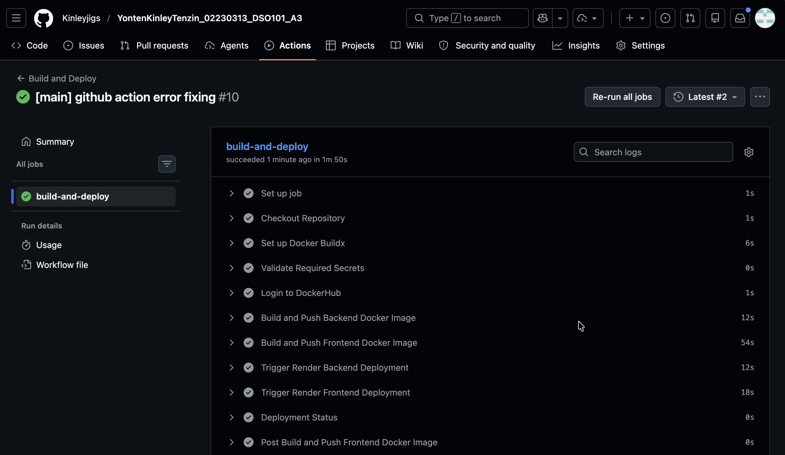
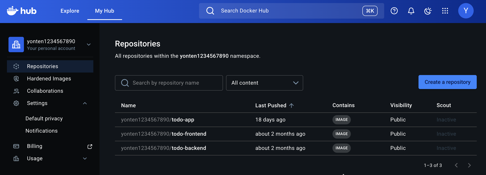
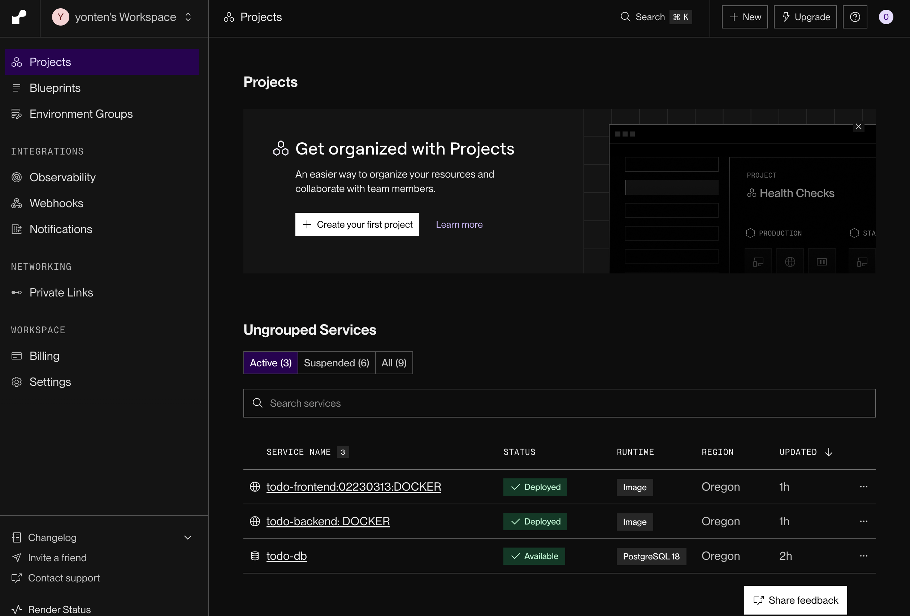

# Todo Application - Assignment 3: CI/CD Pipeline

**Student:** Yonten Kinley Tenzin  
**Student ID:** 02230313  
**Course:** DSO101  
**Assignment:** 3 - GitHub Actions CI/CD Pipeline  

## Quick Links

- **Frontend:** https://todo-frontend-02230313.onrender.com 
- **Backend API:** https://todo-backend-latest-kr1t.onrender.com 
- **Postgres SQL:** https://dashboard.render.com/d/dpg-d828qjgg4nts73fkjglg-a
- **DockerHub:** https://hub.docker.com/repositories/yonten1234567890

## Overview

This project implements a complete **CI/CD pipeline** using GitHub Actions to automate building, testing, and deploying a full-stack Todo application.

**Tech Stack:**
- React 18.2.0 (Frontend)
- Express.js 4.18.2 (Backend)
- PostgreSQL 15 (Database)
- Docker & Docker Compose (Containerization)
- GitHub Actions (CI/CD)
- Render.com (Cloud Deployment)

## Features

- Full CRUD operations for tasks  
- Automated CI/CD pipeline on GitHub  
- Dockerized frontend and backend services  
-  PostgreSQL database on Render  
-  Responsive React UI  
-  RESTful API with error handling  

## Quick Start

### Local Development

```bash
# Prerequisites: Docker Desktop, Node.js 18+

# Clone and navigate
git clone https://github.com/Kinleyjigs/YontenKinleyTenzin_02230313_DSO101_A3.git
cd YontenKinleyTenzin_02230313_DSO101_A3

# Start all services
docker-compose up --build

# Access application
# Frontend: http://localhost
# Backend: http://localhost:5001
# Database: postgres://localhost:5432
```

### Test API

```bash
# Health check
curl http://localhost:5001/health

# Get all tasks
curl http://localhost:5001/tasks

# Create task
curl -X POST http://localhost:5001/tasks \
	-H "Content-Type: application/json" \
	-d '{"title":"Test Task","description":""}'
```

###  CI/CD Pipeline

Every push to `main` branch automatically:
1. Checks out code
2. Builds Docker images for backend & frontend
3. Pushes images to DockerHub
4. Triggers Render.com redeployment
5. Verifies health status


###  GitHub Secrets

Configure in GitHub Repository Settings:
- `DOCKERHUB_USERNAME`
- `DOCKERHUB_TOKEN`
- `RENDER_BACKEND_DEPLOY_HOOK`
- `RENDER_FRONTEND_DEPLOY_HOOK`


### Steps Taken

- Created Dockerfiles for frontend and backend and verified local builds.
- Wrote GitHub Actions workflow at `.github/workflows/deploy.yml` to build and push images.
- Stored `DOCKERHUB_USERNAME` and `DOCKERHUB_TOKEN` as GitHub Secrets; added Render deploy hooks.
- Verified CI run and image publish, then triggered Render redeploys and validated endpoints.

### Challenges Faced

- Getting secrets and deploy hooks configured correctly in GitHub and Render.
- Docker image build caching and tag management across CI runs.
- Intermittent Render build failures due to environment variable mismatches.

### Learning Outcomes

- Hands-on experience creating a GitHub Actions CI/CD pipeline for multi-service Docker projects.
- Improved debugging of container builds and remote deployment hooks.
- Better understanding of image tagging, DockerHub workflow, and Render deployment lifecycle.

### Evidence / Screenshots

Below are the screenshots collected as evidence.
1. Successful GitHub Actions workflow:




2. DockerHub image pushed:



3. Render deployment success:



- Here shows the live deployed of 3 services (frontend, backend, and postgres)

---
